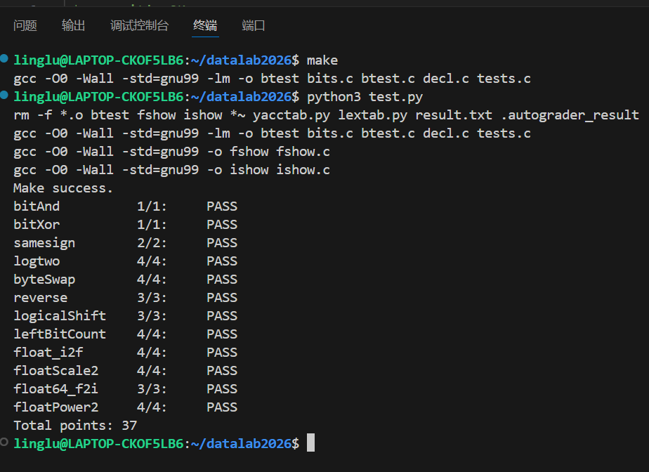

# datalab 报告

姓名：刘锡堃

学号：2025201875

| 总分 | bitAnd | bitXor | samesign | logtwo | byteSwap | reverse | logicalShift | leftBitCount | float_i2f | floatScale2 | float64_f2i | floatPower2 |
| ---- | ------ | ------ | -------- | ------ | -------- | ------- | ------------ | ------------ | --------- | ----------- | ----------- | ----------- |
| 37.00 | 1.00 | 1.00 | 2.00 | 4.00 | 4.00 | 3.00 | 3.00 | 4.00 | 4.00 | 4.00 | 3.00 | 4.00 |

test 截图：



`make` 编译无警告，`python3 test.py` 输出 `Total points: 37`。

## 解题报告

### 亮点

按我自己实现时花的力气和得意程度排序：

1. `float64_f2i` —— 双精度到 int 的位数搬运，含上溢/下溢判断
2. `float_i2f` —— 规格化、就近舍入（round half to even）与进位回退
3. `leftBitCount` —— 白名单里没有比较符也没有 `if`，用 `!` 构造二分判断，并处理 `x = -1` 的 32
4. `byteSwap` —— 在 17 个运算符的预算内完成双字节交换
5. `samesign` —— 0 既不是正数也不是负数带来的特殊语义

### float64_f2i

双精度是 1 位符号 + 11 位阶码 + 52 位尾数，参数 `uf2` 是高 32 位（含符号位与整段阶码），`uf1` 是低 32 位尾数。

我没有去拼一个 64 位整数，而是把 53 位有效数字拆成两段搬运：`hi = (uf2 & 0xFFFFF) | 0x100000` 拿到高 21 位（隐含的前导 1 加上尾数高 20 位），加上 `uf1` 就构成 `significand = hi * 2^32 + uf1`。把它右移 `52 - e` 位（`e` 是真实指数）就得到整数部分，而右移本身是向零截断的，正好符合题目 "rounds towards zero" 的要求。

分段移位是关键：两段不会重叠，所以用或而不是加。

```c
if (s >= 32) mag = hi >> (s - 32);              /* 低 32 位整体被移出 */
else mag = (hi << (32 - s)) | (uf1 >> s);
```

边界处理：阶码为 0 直接返回 0；真实指数小于 0 说明绝对值不到 1，返回 0；真实指数大于 30 时结果必定超出 int 范围，返回 `0x80000000`。这里我把上溢常量写成 `-2147483647 - 1`，因为直接写 `-2147483648` 会被当成无符号或长整型常量，可能引入题目禁止的类型转换。

另外这题的白名单里没有 `==`，所以判断"阶码是不是 0"用的是 `!exp`。

### float_i2f

流程：特例 `x = 0` 直接返回 0；符号位单独取出；负数用 `~ux + 1` 求绝对值。把 `ux` 声明成 `unsigned` 顺便解决了 `x = -2147483648` 取负会溢出的问题——它的绝对值 2³¹ 在无符号里正好表示得出来。

用循环把最高位的 1 顶到第 31 位，循环次数 `e` 就是尾数需要压缩的位数：

```c
while (!(ux >> 31)) { ux <<= 1; e++; }
```

此时阶码字段等于 `158 - e`（真实指数是 `31 - e`，加偏置 127）。尾数取接下来的 23 位，被丢弃的低 8 位用来做舍入：

- 大于 `0x80`：向上进位；
- 恰好等于 `0x80`：正好是一半，采取"就近偶数"，只有尾数最低位已经是 1（奇数）时才进位；
- 其余：直接舍去。

最容易漏的是**舍入进位可能让尾数溢出 23 位**。这时要把尾数归零、同时把 `e` 减 1（等价于阶码加 1）。我第一版就是漏了这一步，在 `0x7FFFFFFF` 这类输入上才暴露出来。

### leftBitCount

先取反：`y = ~x`。题目要求的"从最高位起连续多少个 1"，就变成了"`y` 里前导 0 的个数"。

这题的坑在于白名单只有 `! ~ & ^ | + >> <<`——**没有比较运算符，也没有 `if`**，所以 `logtwo` 里那种 `v >> 16 > 0` 的写法在这里完全不能用。替代办法是用 `!` 判断"是不是 0"：

```c
s = (!(y >> 16)) << 4;   /* 高 16 位全为 0 时给出 16 */
y = y << s;              /* 把已经数过的 0 甩掉 */
```

依次消耗 16、8、4、2、1。每次把 `y` 左移同样位数是安全的，因为甩掉的正是前导 0，不会丢掉有效位。

还有一个特例：`x = -1` 时 `y = 0`，二分链最多只能数到 31（16+8+4+2+1），但题目要求返回 32。所以最后补一句 `r = r + !y`：只有 `y` 为 0 时才加这 1。

### byteSwap

第 k 个字节位于 `k << 3` 位，而 `n`、`m` 是变量，位移量必须动态计算。

这题上限只有 17 个运算符，所以第一件事是把 `n << 3` 和 `m << 3` 存进变量复用——否则光是重复的移位就会超出预算。

然后三步走：取出两个字节（右移对齐后 `& 0xFF`）、用 `~((0xFF << on) | (0xFF << om))` 把这两段清零、最后交叉贴回（第 n 个字节贴到第 m 个字节的位置，反之亦然）。最终用了 15 个运算符。

`n == m` 的情况不需要特判：取出的两个字节相同，清掉再贴回等于没变。

### samesign

题目特别规定 0 既不是正数也不是负数：`samesign(0, 0) = 1`，但 `samesign(0, 正数) = 0`。这意味着不能只看符号位——0 和正数的符号位都是 0，那样会把 `samesign(0, 1)` 判成 1。

这题白名单里没有 `>` `<` `==`，也没有 `||`，但给了 `if` / `else` / `&&`。所以我用嵌套 `if` 分成四种情况：

1. 两个都不是 0：看 `(x >> 31) ^ (y >> 31)`，为 0 则同号；
2. `x` 不是 0 而 `y` 是 0：返回 0；
3. `x` 是 0 而 `y` 不是 0：返回 0；
4. 两个都是 0：返回 1。

### 其余题目

| 函数 | 做法 | 运算符/上限 |
| ---- | ---- | ----------- |
| `bitAnd` | 德摩根律：`~(~x \| ~y)` | 4/7 |
| `bitXor` | 异或 = 至少一个为 1 且并非都为 1，再用德摩根律把"或"换成 `~` 和 `&` | 7/7 |
| `logtwo` | 二分：把 `(v >> 16 > 0)` 这类比较的结果当成 0/1 直接左移作位权，逐级试 16/8/4/2/1，并用同一个值当作 `v` 的移位量 | 23/25 |
| `reverse` | 白名单允许循环，所以直接循环 32 次：先左移 `r` 腾出最低位，再把 `v` 的最低位或进去 | 5/30 |
| `logicalShift` | 先按 C 的算术右移，再用掩码把高 n 位清零；掩码从 `1 << 31` 出发构造（它本身是负数，算术右移会自动补 1），这样避免了 `n = 0` 时 `1 << 32` 这个未定义行为 | 6/20 |
| `floatScale2` | 按阶码分三类：255（INF/NaN）原样返回；0（非规格化数）尾数左移一位；其余阶码加 1，加到 255 就返回 ±INF | 14/30 |
| `floatPower2` | 按 x 分四段：大于 127 返回 +INF；−126 到 127 之间阶码字段取 `x + 127`；−149 到 −127 之间是非规格化数，尾数取 `1 << (x + 149)`；小于 −149 返回 0 | 9/30 |

## 反馈/收获/感悟/总结

这个 lab 花时间最多的地方不是位运算本身，而是每道题都缺几个最顺手的运算符——它逼着我在动手之前先把思路想清楚，而不是先写出来再改。浮点那四题是我第一次真正把 IEEE 754 的符号位、阶码、尾数拆开数了一遍，以前只是知道"有个偏置 127"。

印象最深的是 `leftBitCount`：既不能用 `if`，也不能比较，只能用 `!` 判断"是不是 0"，这个思路我一开始完全没想到。另外 `float_i2f` 的舍入进位也是我自己漏过一次才补上的。

## 参考的重要资料

- 《深入理解计算机系统》（CS:APP）第 2 章"信息的表示和处理"——补码、位运算与 IEEE 754 浮点格式的推导
- CS:APP 官方 Data Lab 说明——本题的合法运算符限制与评分方式与它同源
- IEEE 754-2019 标准中单精度与双精度格式的定义（含非规格化数与特殊值）
- C 语言标准 C99 6.5.7 关于移位运算符的规定（有符号左移溢出与移位量越界均为未定义行为）
